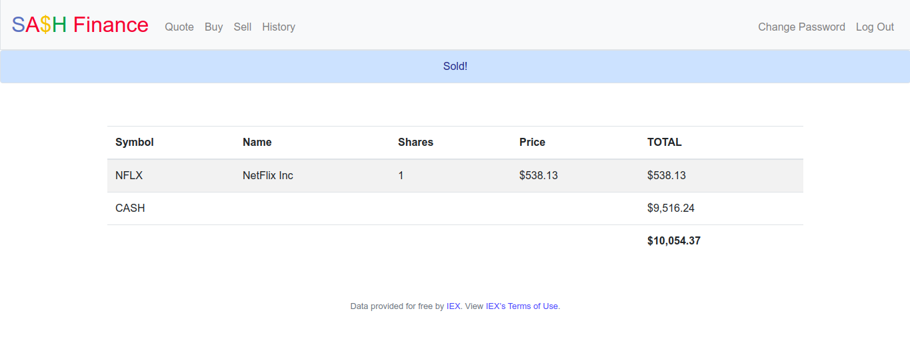

# SA$h Finance
A website via which users can “buy” and “sell” stocks.<br>



## Background
SA$H is a web app via which you can manage portfolios of stocks. Not only will this tool allow you to check real stocks’ actual prices and portfolios’ values, it will also let you buy (okay, “buy”) and sell (okay, “sell”) stocks by querying IEX for stocks’ prices.<br><br>
Indeed, IEX lets you download stock quotes via their API (application programming interface) using URLs like https://cloud-sse.iexapis.com/stable/stock/nflx/quote?token=API_KEY. Notice how Netflix’s symbol (NFLX) is embedded in this URL; that’s how IEX knows whose data to return. That link won’t actually return any data because IEX requires you to use an API key (more about that in a bit), but if it did, you’d see a response in JSON (JavaScript Object Notation) format.
```
{  
   "symbol": "NFLX",
   "companyName": "Netflix, Inc.",
   "primaryExchange": "NASDAQ",
   "calculationPrice": "close",
   "open": 317.49,
   "openTime": 1564752600327,
   "close": 318.83,
   "closeTime": 1564776000616,
   "high": 319.41,
   "low": 311.8,
   "latestPrice": 318.83,
   "latestSource": "Close",
   "latestTime": "August 2, 2019",
   "latestUpdate": 1564776000616,
   "latestVolume": 6232279,
   "iexRealtimePrice": null,
   "iexRealtimeSize": null,
   "iexLastUpdated": null,
   "delayedPrice": 318.83,
   "delayedPriceTime": 1564776000616,
   "extendedPrice": 319.37,
   "extendedChange": 0.54,
   "extendedChangePercent": 0.00169,
   "extendedPriceTime": 1564876784244,
   "previousClose": 319.5,
   "previousVolume": 6563156,
   "change": -0.67,
   "changePercent": -0.0021,
   "volume": 6232279,
   "iexMarketPercent": null,
   "iexVolume": null,
   "avgTotalVolume": 7998833,
   "iexBidPrice": null,
   "iexBidSize": null,
   "iexAskPrice": null,
   "iexAskSize": null,
   "marketCap": 139594933050,
   "peRatio": 120.77,
   "week52High": 386.79,
   "week52Low": 231.23,
   "ytdChange": 0.18907500000000002,
   "lastTradeTime": 1564776000616
}
```

## Configuring

- Clone the repository.
- Inside a terminal window Install virtualenv -
```
pip install virtualenv
```
- Navigate into the project folder and Create a virtual environment using -
```
python -m virtualenv env
```
- Activate the environment 
```
source env/bin/activate
```
- Install the dependencies
```
pip install -r requirements.txt
```

Before getting started, we’ll need to register for an API key in order to be able to query IEX’s data. To do so, follow these steps:

- Visit iexcloud.io/cloud-login#/register/.
- Enter your email address and a password, and click “Create account”.
- On the next page, scroll down to choose the Start (free) plan.
- Once you’ve confirmed your account via a confirmation email, sign in to iexcloud.io.
- Click API Tokens.
- Copy the key that appears under the Token column (it should begin with pk_).
- Create a `.env` file and paste the contents of .env.example into it.
- Add the `API_KEY`.
```
API_KEY=value
```
where `value` is that (pasted) value, without any space immediately before or after the `=`. 

## Running
Start Flask’s built-in web server (within finance/):
```
$ flask run
```
Visit the URL outputted by flask to see the web app in action.


